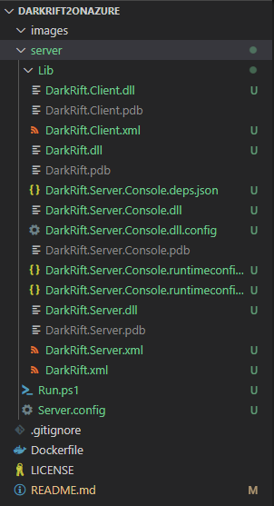
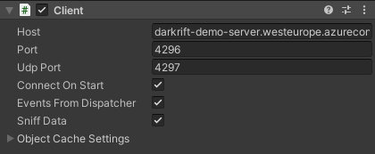

# DarkRift2OnAzure
This repo/guide is trying to demonstrate how to run DarkRift2 server on Azure Container Instances.

## Prerequisites
 - [DarkRift Networking 2 - Pro](https://assetstore.unity.com/packages/tools/network/darkrift-networking-2-pro-95399)
 - [Docker](https://docs.docker.com/desktop/)
 - [Azure Container Registry](https://docs.microsoft.com/en-us/azure/container-registry/container-registry-get-started-portal#:~:text=Azure%20Container%20Registry%20is%20a,instance%20with%20the%20Azure%20portal.)

 You can also use DockerHub but this guide will be using Azure Container Registry.

## Step 0

Create a directory named "server" in root of this repository.

```
mkdir server
```

## Step 1
Unzip "DarkRift Server (.NET 5.0).zip" into server dir we just created. 
Zip file should be located in DarkRift Networking unity package.



## Step 2

We need to modify the Server.config

**Azure Container Instances do not let you use same port for both TCP and UDP**. 
For that reason we need to spefify a different UDP port.
```xml
<listener name="DefaultNetworkListener" type="BichannelListener" address="0.0.0.0" port="4296">
	<settings noDelay="true" updPort="4297"/>
</listener>
```

## Step 3
Now it's time to create our Plugins project
```
dotnet new classlib --name DarkRift.Plugins --framework "net5.0" -o src
rm ./src/Class1.cs
```
Open the .csproj we just created and add the following.
```xml
<PropertyGroup>
	<ProduceReferenceAssembly>false</ProduceReferenceAssembly>
	<AppendTargetFrameworkToOutputPath>false</AppendTargetFrameworkToOutputPath>
	<AppendRuntimeIdentifierToOutputPath>false</AppendRuntimeIdentifierToOutputPath>
</PropertyGroup>

<PropertyGroup>
	<OutputPath>../server/Plugins</OutputPath>
</PropertyGroup>

<ItemGroup>
	<Reference Include="DarkRift">
		<HintPath>../server/Lib/DarkRift.dll</HintPath>
	</Reference>
	<Reference Include="DarkRift.Server">
		<HintPath>../server/Lib/DarkRift.Server.dll</HintPath>
	</Reference>
</ItemGroup>
```

For the purpose of this guide we can populate the project we just created with some demo plugins.
We can use for example [BlockDemoDarkRiftPlugin](https://github.com/DarkRiftNetworking/BlockDemoDarkRiftPlugin/tree/master/BlockDemoDarkRiftPlugin)

After you add your plugins build the project.
```
cd src
dotnet build
```

## Step 4
Build the docker image.
```
docker build -t darkrift-demo-server-image -f Dockerfile .
```

## Step 5
Upload the docker image to Azure Container Registry. 
```
docker login <yourregistry>.azurecr.io
docker tag darkrift-demo-server-image <yourregistry>.azurecr.io/darkrift-demo-server-image
docker push <yourregistry>.azurecr.io/darkrift-demo-server-image
```

## Step 6
Deploy an Azure container instance. There are several ways to do it.
[Azure Portal](https://docs.microsoft.com/en-us/azure/container-instances/container-instances-quickstart-portal)
or
[Docker CLI](https://docs.docker.com/cloud/aci-integration/)

Make sure to publish ports **4296 for TCP and 4297 for UDP**

## Step 7
Our server should be up and running by now! There is just one final touch and thats the client.

UnityClient is using just one port by default. Locate UnityClient.cs in your Unity project.
It's probably in /Assets/DarkRift/DarkRift/Plugins/Client/

Open it and you will notice this bit
```csharp
private void Start()
{
	//If connect on start is true then connect to the server
	if (connectOnStart)
		Connect(host, port, noDelay);
}
```

All you need to do is pass udp port.
```csharp
Connect(host, port, 4297, noDelay);
```

We should probably put a little more affort into this...
So you won't use a magic constant and probably modify the Editor script as well.

End result should be something like this:



And that's it! First DarkRift 2 server running on Azure Container Instances.
To learn more about DarkRift visit [darkriftnetworking.com](https://www.darkriftnetworking.com/)